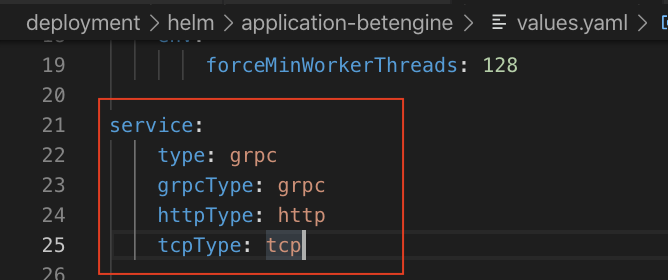
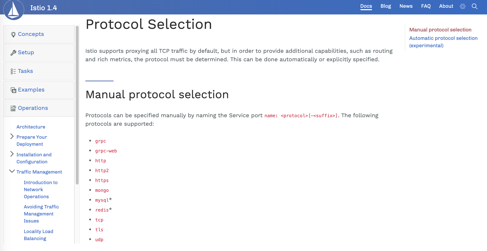

## Helm Package<Mac or linux>

### Module ###

``` sh

    helm init

    helm plugin install --version master https://github.com/sonatype-nexus-community/helm-nexus-push.git

    helm nexus-push login -u <username> -p <password>

    helm repo add <repo-name> <repo-url>

    helm package <Charts Folder>
    helm nexus-push <repo-name> <Charts.tar>
    # helm nexus-push <repo-name> ./<Charts Folder>

```

### Stage ###

``` sh
    helm dependency update
    helm package <Charts Folder>
    helm nexus-push <repo-name> <Charts.tar>
    # helm nexus-push <repo-name> ./<Charts Folder>
```

## Helm Deployment <Kubernetes Cluster>

``` sh
    helm repo update

    #helm upgrade --install --force --recreate-pods <ReleaseName> <repo>/<Charts>
    # --install flag is  releaseName don't existed that run install. 
    # --recreate-pods flag is delete all pods recreate all.
```

## Helm Service Type

- Istio接管的服務，對外開放的service port name必須符合Istio規範，Istio才能順利導流。
- 以下以Betengine為例:
  


參考來源:[Istio官網](https://istio.io/docs/ops/traffic-management/protocol-selection/)